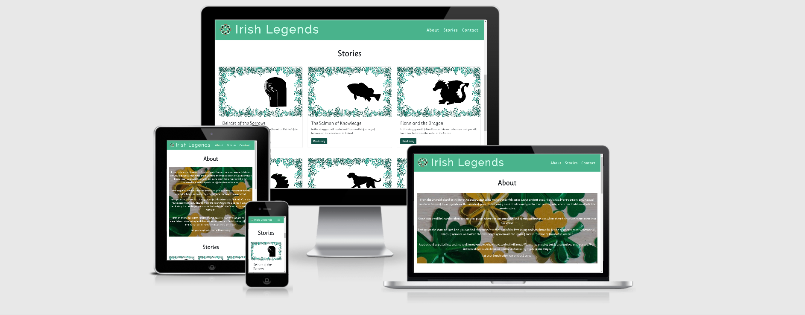

 

---
# Irish Legends

At the time when your  little one forgets to bring their favourite book on a trip and the story time routine is under threat; this site will provide you with collection of the most popular stories to read on the go.
With an easy access the on phone or tablet an adventure to Ireland of the past has never been easier. 

Get comfy and let yourself to be enchanted by Irish Legends.

Live demo of this site [here](https://janabuckova.github.io/Irish-Legends/)

---

## UX (User Experience)

### Website Goals
The site’s intended users are young readers and parents of young readers who enjoy reading stories from Irish Mythology. 

Starting as single page site with a simple navigation and reduced content in order for young reader not to get overloaded with too much information but with a potential for future expansion based on users’ story suggestions.

### User Stories (parents)

* As a user I want the site to be easy to navigate even by my 7 year old (Chris, Dublin)
* As a user I want the text to be written in nice writing/font (Joanna, Skerries)
* As a user I want to be able to send feedback or queries (Martin, Naas)
* As a user I would like an option to receive news email/notification or when new stories are added (Martin, Nass)
* As a user I want to be able to increase the font size so my daughter can read alongside me (Chris, Dublin)
* As a user I would like to see your social media posts (Joanna, Skerries)

### Design choices

* I have gone for a minimalistic design for more than a half of the site with only one 
dominant image on the site in the about section to capture the user's attention. 
* The colours were specifically chosen to represent Ireland's nature hence the use of different shades of green.
* Navigation of the site was created with young user in mind but also with the potential of the expansion of the site. 
The nav bar is fixed on the top so the user doesn't need to scroll excessively through the page.
* The font used was chosen to compliment the design and the theme of the overall site.

### Wireframes

Wireframes for this project were created at the beginning of the project using [Balsamiq](https://balsamiq.com) and provided a useful visual aid for the 
intended structure on different devices. 
After initial discussion with my mentor I deviated from my design slightly. 

In the initial design:

* In "About" section I was unsure how an image would look like in the background of the section and at the time I was also unable to find a suitable one 
to match the colour theme of the site. At the end I have opted for visually pleasing background image. 

* In "Stories" section I have chosen to display image with carousel slider next to it where the user would navigate through the story by clicking arrow 
buttons. Instead I have chosen to use card-deck with modal for each story as it provides better user experience (less clicks for the user).

* Considering a user story, I have opted for newsletter sign up form which I placed in the footer which is not on the initial design.

* I have decided not to use pink colour other than in Logo. 

Wireframes and colour composition can be found at the below location.

* [Desktop](wireframes/desktop.pdf "Desktop")
* [Tablet](wireframes/tablet.pdf "Tablet")
* [Mobile](wireframes/mobile.pdf "Mobile")
* [Colour-composition](wireframes/colour-composition.pdf "colour-composition")

## Features

### Existing Features
* **Navigation Bar** - responsive navigation bar that enables the user to navigate through the site
* **About Section** - provides user with brief commentary on Irish Mythology
* **Stories Section** - responsive section containing stories for users to read
* **Modals** - each story is contained in scrollable modal to ensure positive UX
* **Contact Form** - allows user to contribute to the content of the site or comment 
* **Subscribe Form** - allows user to subscribe to newsletter to receive latest updates
* **Social Media Links** - allow users to stay connected on social media 

### Features Left to Implement
* **Additional Page** - when the site receives more interest and user would like to see more stories
a separate page would be added
* **Font Increase** - based on the UX story a font size increase would be added
* **Font Change** - I would like to look into a possibility of changing font on modals depending on the reader
(e.g. dyslexic friendly)
* **Audio Version of Stories** - depending on user's interest I would like to add and audio version of stories

## Technologies Used

* [HTML5](https://en.wikipedia.org/wiki/HTML5)
  - This project used HTML5 for building the structure of the site
* [CSS3](https://en.wikipedia.org/wiki/Cascading_Style_Sheets) 
  - This project used CSS3 for styling of the site
* [Bootstrap](https://getbootstrap.com/) 
  - This project used Bootstrap - CSS framework responsiveness of the site, including JavaScript plugins
* [Google Fonts](https://fonts.google.com/) 
  - This project used Google Fonts library for customised font
* [Font Awesome](https://fontawesome.com/) 
  - This project used Font Awesome icon toolkit for Social Media Logos
* [GitPod](https://code.visualstudio.com/) 
  - This project used GitPod - IDE for local development
* [GIT](https://git-scm.com/) 
  - This project used GitPod for version control
* [GitHub](https://github.com/) 
  - This project used GitHub for hosting the repository and the live website preview

## Testing

Throughout the project I have relied on Chrome and Opera Developer tools which had proven to be invaluable for testing on responsiveness on different devices.

I have validated the HTML and CSS code in [W3C Markup Validation](https://validator.w3.org/) and [W3C CSS validation](https://jigsaw.w3.org/css-validator/), the results are enclosed [here](testing/w3c-validatio.pdf "Validation")
To validate the code I clicked on the provided link and in the tab validate by URL I entered url of my site. (e.g. https://janabuckova.github.io/Irish-Legends)

## Testing user Stories - implemented features

The testing was completed in Chrome Opera, Firefox, Edge and IE on laptop. I do now own any Apple device and
therefore was unable to test Safari browser.

1. Navigation of the site
  * From Navigation bar I clicked each navigation link
  * Links worked and navigated to the appropriate section of the site
  * Navigation bar stayed fixed to the top to ensure easy navigation without too much scrolling

2. Font choice rendered
  * The chosen Font Ruloko rendered in all browsers 
  * The media query for laptop and desktop for font increase worked as expected

3. Contact Form
 * From navigation bar clicked 'Contact'
 * Tried to submit the empty form and verified that an error message about the required fields appeared
 * Tried to submit the form with an invalid email address and verified that a relevant error message appears
 * After all fields were populated tried to 'Submit' the form. 404 error message appeared due to the fact the 'Action' and 'Method'
attribute were not include in the design of the form. (not a requirement of this project)

 * **Observation** - Firefox browser doesn't provide user with the message how correct email address should look like (contain @), only 'Please enter and email address'
From experience with my father I can confirm this can be little confusing for older users who are not used to forms and only use email on tablet or phone by clicking an email icon. 
This should be taken into consideration when designing websites in general. A proper placeholder would make the user experience more positive. Note to myself **Think of the intended user** (younger/older audience)

4. Subscribe Form
  * From footer section tried to submit the form with an invalid email address and verified that a relevant error message appears
  * After the field was populated tried to 'Submit' the form. 404 error message appeared due to the fact the 'Action' and 'Method'

5. Social Media
 * From footer section clicked on each social media icon and was redirected to the appropriate social media site
 * As designed each social media site opened in a new tab 
 * Same **Observation** as above applies

 ## Testing other features
 
 Tested on desktop, tablet, mobile using Developer tools. 
1. Navigation bar logo - resizing
 * When site viewed on mobile and tablet verified that the logo is responsive and resizing on smaller screen

2. Toggler/Hamburger menu
 * On mobile device the navigation bar was designed to collapse into a Toggler
 * Tested and verified that the toggler appeared as intended on smaller and larger mobile screen 

3. Modals in Stories section
  * Clicked each button and verified that modal window appeared as designed. Large modal on desktop and tablet held horizontally. 
  Small modal on tablet held vertically and mobile

4. Smooth Scroll
 * Verified that works as intended with exception of IE (not working at all). Also, when tested in Edge and the Firefox the scroll is so quick that almost appears as 'jump'

## Testing Responsiveness

The responsiveness was tested in real mobile environment using **OnePlus 3**, **Samsung Galaxy A3** and tablet **Samsung Galaxy Tab A**.
In addition, I used Developer tools for different devices and 14" and 15.6" laptops.

1. **On mobile** I am very satisfied with the overall responsiveness as the content fits nicely on both smaller and larger mobile screens. Everything is aligned to center, cards are placed vertically in single column. Just very nice experience.
* Observation - In case when more stories are added to the site there would be extensive scrolling through the site and therefore a dropdown menu in navigation bar should be considered. 
Potentially as mentioned above the stories should be placed on separate page and navigation link should be used to 'take' user to the relevant page

2. **On tablets** the responsiveness is good both on horizontal and vertical view. The content is aligned and displays well. there is enough space between cards in vertical view and the content in not 'squished'.
The Sign Up form for newsletter in footer - input field and submit button are displayed next to each other and the Input field is wide enough on real device which was initially a concern.
* **Bug** - In both vertical and horizontal views the buttons (Read story) triggering the modal are not aligned. I have used alignment to left on medium and large screen and center on small but 
was unable to position the buttons to left bottom on medium size screens. This feature to be addressed in the future.
* Observation - I would like to get feedback from multiple users - using different tablets. Considering displaying stories in 2 columns on tablets

3. **On Laptop and Desktop**
* Considering the reduced amount of content on laptop screens tested (13” and 15.6”) the site displays well, better than on tablet (in my opinion) Though the content is targeted for mobile and tablet.
* **Bug/Observation** -I have also used [Responsive Checker](https://www.responsivedesignchecker.com/) to test larger screens and from 20” up the site didn’t render well. The is not enough content to cover the background image. I have used media query to reduce the image height, 
but the image still stayed quite large. Is the screen expands the Stories section in particular became unappealing and the overall site gave feeling of being ‘bare’.

## Deployment

To deploy this page to GitHub Pages from [its GitHub repository](https://anabear.github.io/ZestyTails/), the following steps were taken:

1. On GitHub, navigate to the site's repository.
2. Under the repository name, click on **Settings**.
3. Scroll down to the **GitHub Pages** section.
4. Under **Source** click the drop-down menu labelled **None** and select **Master Branch**.
5. On selecting **Master Branch** the page is automatically refreshed, the website is now deployed.
6. Scroll back down to the **GitHub Pages** section to retrieve the link to the deployed website.
7. A green box should appear with the following message 
Your site is published at `https://janabuckova.github.io/Irish-Legends/`

For more information on how to deploy a website on GitHub, [please visit this website](https://help.github.com/en/github/working-with-github-pages/configuring-a-publishing-source-for-your-github-pages-site).

### How to run this project locally

To clone this project from GitHub:

1. On GitHub, navigate to the main page of the repository.
2. Under the repository name, click the green button **Clone or download**.
3. In the **Clone with HTTPs** section, copy the clone URL for the repository.
4. Open Terminal.
5. Change the current working directory to the location where you want the cloned directory to be made.
6. Type `git clone`, and then paste the URL you copied in Step 3.
   `git clone https://janabuckova.github.io/Irish-Legends/.git`
7. Press **Enter**. Your local clone will be created.

For further reading and troubleshooting on cloning a repository [from GitHub](https://help.github.com/en/github/creating-cloning-and-archiving-repositories/cloning-a-repository).

## Credits

### Content
The content in Stories section was copied from books Irish Legends for children [Gill Books](https://www.gillbooks.ie/) and Best-Loved Irish Legends [The O'Brien Press](https://www.obrien.ie/) 

README reference for deployment was copied from [this](https://github.com/D0nni387/Luxury-Door-Solutions/blob/master/README.md) readme file by former User-Centric-Frontend Slack channel lead Richard.

### Media
The photos used in this site were obtained from:
 * [Shutterstock](https://www.shutterstock.com/home)
 * [Pixabay](https://pixabay.com/images) - Clipart for Stories images
 * [Sketchpad 5.1](https://sketch.io) - Stories images created by me using inbuilt Clipart Library
 * [Logomakr](https://logomakr.com/) - Site logo created by me using inbuilt Library
 * [TinyJPG](https://tinyjpg.com/) - Used to compress images

### Acknowledgements

I received inspiration for this project from [Storynory](https://www.storynory.com/category/myths/norse/) but wanted to create a site with little less content.

I would like thank my felow students on [Code Institute](https://codeinstitute.net/) Slack channel for their help and of course my mentor Precious Ijege for the amazing advice and support.

### Disclaimer
Irish Legends is a fictional story reading site. Content of the stories mentioned was used for educational purposes and is Cpyrighted by the publishing companies.
For this reason I did not put a Copyright into my footer page.